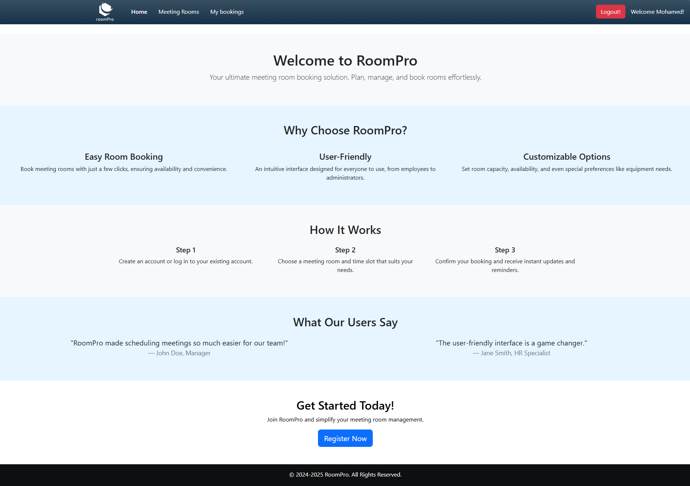
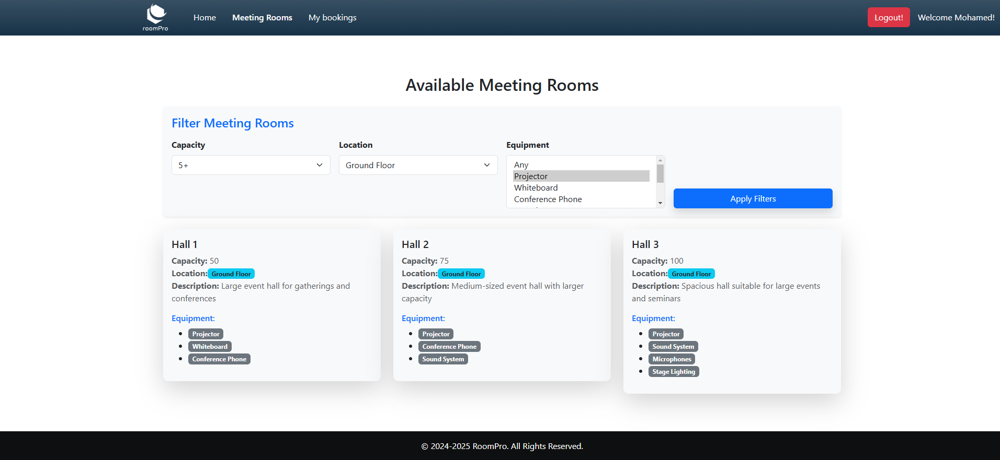
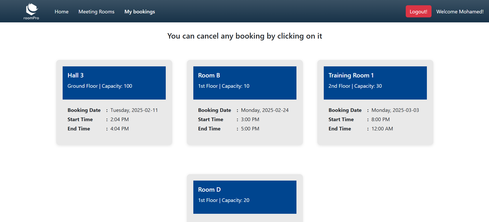
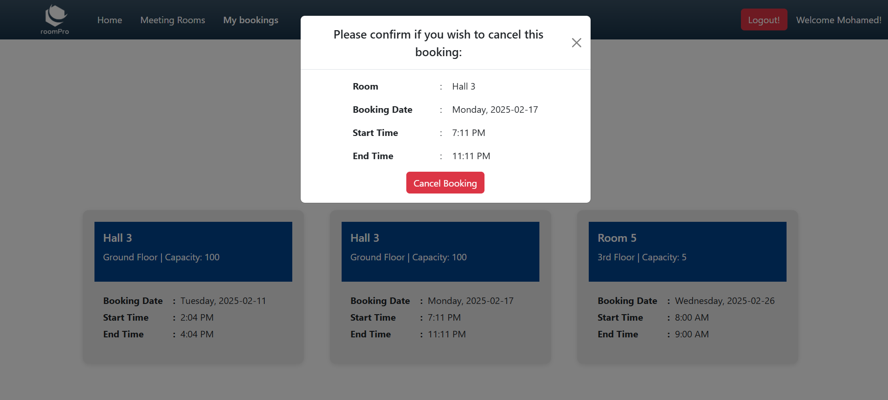

# Ongoing Web Application Project: RoomPro

## Project Overview

RoomPro is a web application that simplifies room booking and management. Built with `Spring Boot` for the backend and `Angular` for the frontend, it follows a clean architecture that separates concerns into Controllers, Services, Repositories, and Entities for scalability and maintainability. The app securely stores user and room data in a relational database.

# 🚀 Current Release: v2.3.0
## 🎉 Features up to this Release:

- `Admin pannel`: Introduced an Admin Panel :
    - `Room setup` :
        - Add new rooms via admin panel
        - Delete existing rooms

    - `Room Status & availability` :
        - Add cleaning periods
        - Add maintenance periods

- `Toast Notifications`: Real-time updates for events like successful logins and bookings.

- `Weekend Booking Restriction`: Prevents weekend bookings, allowing only future bookings during business hours.

- `Invalid Booking Restriction`: No double bookings and disallowing bookings outside of business hours (8 AM - 6 PM).

- `Calendar Integration`: FullCalendar to display room bookings with week view and dynamic reservations.

## 🏠 Pages Overview (current progress)

### 1️⃣ Home Page ( /home )

### 2️⃣ Rooms Page ( /rooms )

### 3️⃣ My Bookings Page ( /my-bookings )

### 4️⃣ Booking cancelation popup ( /my-bookings/cancel )

## Key Features

### User Management:

 - Registration: Users can register by providing details such as first name, last name, email, password, and role (e.g., Admin, User).

 - Authentication (Planned): Secure user authentication and role-based access control.

### Room Booking:

 - Users can view and book available rooms.

 - Bookings include start and end times, ensuring no overlapping reservations.

### Admin Features (Planned):

 - Management of rooms, including adding, updating, and deleting rooms.
Viewing and managing all bookings.

### Database Integration:

 - Persistent storage for users, roles, rooms, and bookings using `PostgreSQL` database.

 - Validation to ensure data consistency, such as checking for booking overlaps.

## Project Architecture

### 1. Entities
Entities represent the core data structures of the application. These classes are annotated with JPA annotations to map them to database tables.

 - User: Contains fields like userId, firstName, lastName, email, password, and role.

 - Role: Stores user roles such as Admin or User.

 - Room: Represents rooms with details like roomId, capacity, description, location, and name.

 - Booking: Tracks bookings with fields such as bookingId, startTime, endTime, room, and user.

### 2. Repositories
Repositories act as the data access layer and extend Spring Data JPA, providing methods to interact with the database.
 
 - UserRepository: Handles operations related to the User entity (e.g., finding users by email).
 
 - RoleRepository: Manages role-related queries.
 
 - RoomRepository: Manages room data access.
 
 - BookingRepository: Ensures no overlapping bookings via custom queries.

### 3. Services
Services contain business logic and act as intermediaries between controllers and repositories.
 
 - RegistrationService: Handles user registration, including validations (e.g., duplicate email checks) and role assignment.
 
 - BookingService: Validates booking data and interacts with the database to create new bookings.

### 4. Controllers
Controllers handle HTTP requests and responses, exposing RESTful APIs to the frontend.

 
 - UserController: Manages endpoints for user registration and authentication.
 
 - RoomController (Planned): Handles room-related operations.
 
 - BookingController: Manages booking functionality.

### 5. Database
The application uses a relational database to persist data. Tables include:

 - users: Stores user details. Each user can have multiple bookings.
 - roles: Stores predefined roles. Ther are three roles : `Admin`, `Manager` and `Employee`
 - rooms: Stores room details. A room can be booked multiple times.
 - RoomEquipment : Each rome have some equipments.
 - bookings: Tracks user reservations.

## Current Progress
### Backend:

- User registration API implemented and integrated with the database.
- Room and booking entities created.
- Validation for booking conflicts implemented.

### Frontend:

- Registration form created with Angular.
- API integration for user registration.