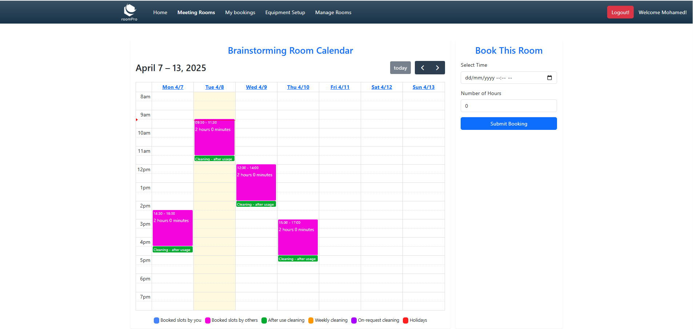
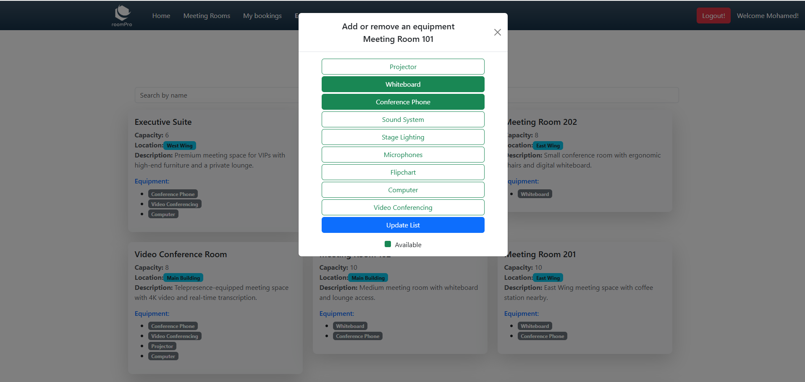
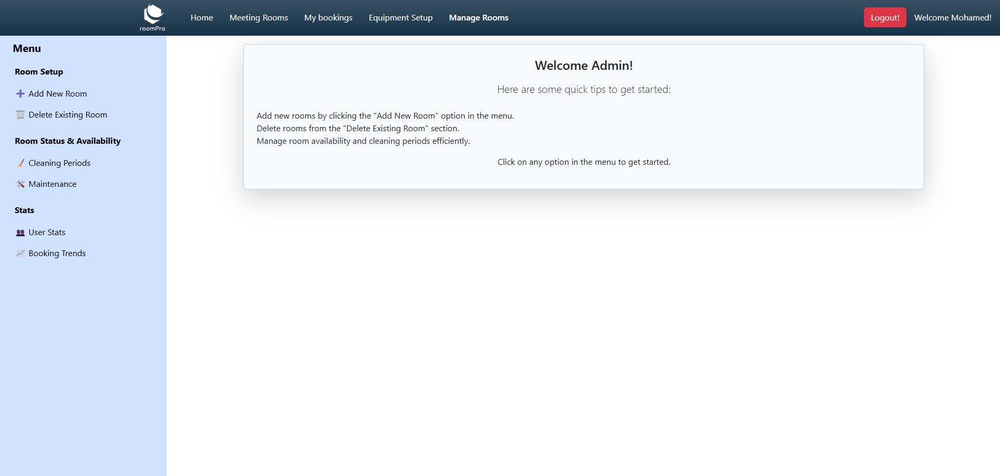
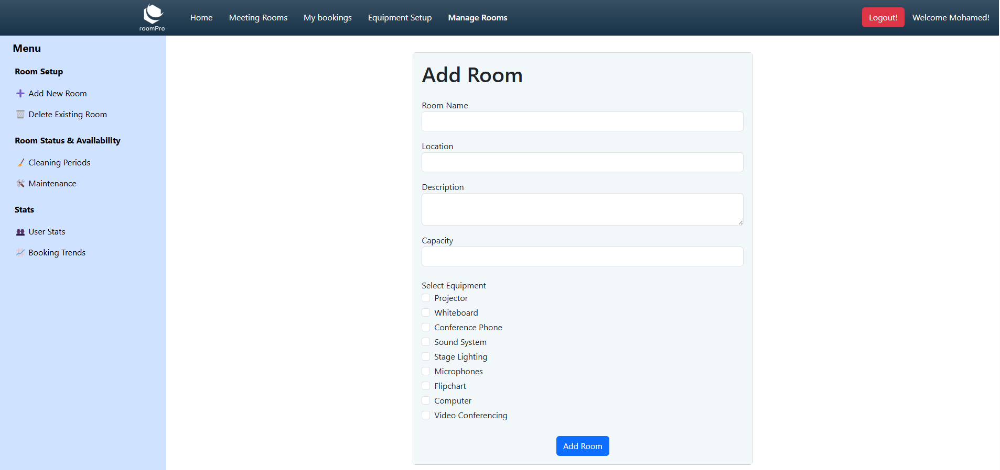
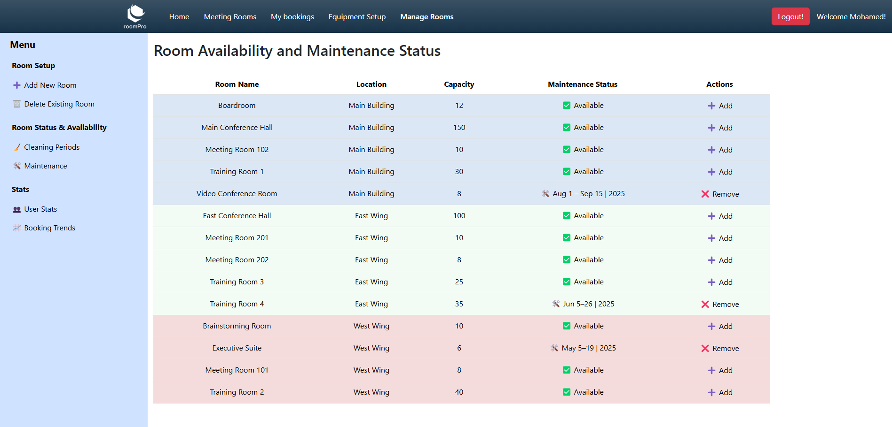

# Ongoing Web Application Project: RoomPro

## Project Overview

RoomPro is a web application that simplifies room booking and management. Built with `Spring Boot` for the backend and `Angular` for the frontend, it follows a clean architecture that separates concerns into Controllers, Services, Repositories, and Entities for scalability and maintainability. The app securely stores user and room data in a relational database.

# 🚀 Current Release: v2.5.0
## 🎉 Features up to this Release:

- `Admin pannel`: Introduced an Admin Panel :
    - `Room setup` :
        - Add new rooms via admin panel
        - Delete existing rooms

    - `Room Status & availability` :
        - Add cleaning periods
        - Add maintenance periods

    - `Booking Trends` :
        - 📊 Booking Statistics
        - ⏰ Peak Hour Tracking:
        - 📈 Peak Day Insights
        - 🕓 Average Booking Duration
        - 📋 Most Booked Room

- `Adding holidays`:
    - Integrated with `Nager.Date API` to automatically fetch public holidays based on the current year and country.
    - Prevents users from booking rooms on official public holidays.

- `Toast Notifications`: Real-time updates for events like successful logins and bookings.

- `Weekend Booking Restriction`: Prevents weekend bookings, allowing only future bookings during business hours.

- `Invalid Booking Restriction`: No double bookings and disallowing bookings outside of business hours (8 AM - 6 PM).

- `Calendar Integration`: FullCalendar to display room bookings with week view and dynamic reservations.

## 🏠 Pages Overview

### 1️⃣ Home Page

    

### 2️⃣ Rooms Page

    

### 3️⃣ Rooms Page / room callendat

    

### 4️⃣ My Bookings Page

    

### 5️⃣ Equipment update

    

### 6️⃣ Manage rooms

    

### 6️⃣.1️⃣ Add new rooms

    

### 6️⃣.2️⃣ Change cleaning type

    

### 6️⃣.3️⃣ Set maintenance periods

    

### 6️⃣.4️⃣ Booking trends

    

## Key Features

### User Management:

 - Registration: Users can register by providing details such as first name, last name, email, password, and role (e.g., Admin, User).

 - Authentication: Secure user authentication and role-based access control.

### Room Booking:

 - Users can view and book available rooms.

 - Bookings include start and end times, ensuring no overlapping reservations.

### Admin Features:

 - 📅 Management of Rooms:

    - Add, update, and delete rooms.
    - Define room attributes (capacity, location, description) for better management.
    - Set room availability for bookings and maintenance.

 - 🧹Setting cleaning periods : there are tree types

    - Daily Cleaning: Set recurring daily cleaning times for each room.
    - Weekly Cleaning: Define cleaning schedules on specific days of the week for room rotation.
    - On-demand Cleaning: Allow users to request cleaning during their stay, with flexible timing and notifications for admins.

 - 🛠 Setting Maintenance Periods:

    - Schedule maintenance periods for each room to ensure readiness and minimize downtime.
    - Automatically block out room availability during maintenance windows.

 - 📈 Admin Views Booking Trends
    - Admins can get detailed insights into booking data, helping to optimize room usage and management:
      - Total Bookings: See the total number of bookings monthly.
      - Peak Hours: Identify the busiest hours of the day when bookings are highest.
      - Busiest Days: Visualize the days of the week that have the highest booking activity.
      - Average Booking Duration: View the average duration of bookings, which helps in planning room usage more efficiently.
      - Most Booked Room: See which room has the highest number of bookings, helping prioritize maintenance or improvements for that space.

### Database Integration:

 - Persistent storage for users, rooms, and bookings using `PostgreSQL` database.

## Project Architecture

### 1. Entities

Entities represent the core data structures of the application. These classes are annotated with JPA annotations to map them to database tables.

- `Users` : Represents users of the system, such as admin or regular users.

- `Role` :  Defines the roles available in the system, such as Admin and User. 

- `UserPrincipal` : Represents the principal (authenticated user) in the system. This entity typically holds the user details (such as username, password, roles) that are needed for authentication and authorization.

- `Booking` : Represents a booking made by a user for a specific room. 

- `Room` : Represents a room in the system. 

- `Equipment` : Represents the various equipment available for rooms. 

- `RoomEquipmentMapping` : Represents the mapping of equipment to rooms. It shows which equipment is available in which room.

- `CleaningType` : Defines various types of cleaning tasks, such as daily, weekly, and on-demand cleaning.

- `CleaningAfterUse` : Represents a specific cleaning task that occurs after a room is used, typically when the room is vacated.

- `CleaningWeekly` : Represents cleaning tasks that occur on a weekly schedule. 

- `RoomCleaningAssignment` : Represents the assignment of cleaning tasks to specific rooms. 

- `Maintenance` : Represents scheduled maintenance tasks for rooms. 
