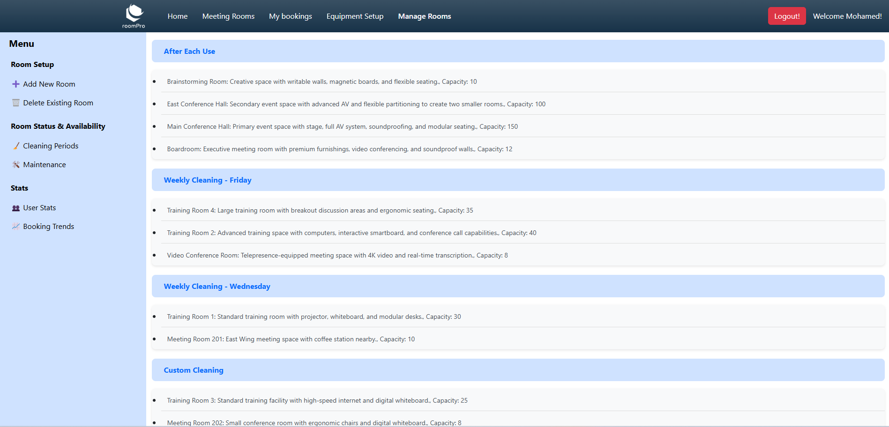
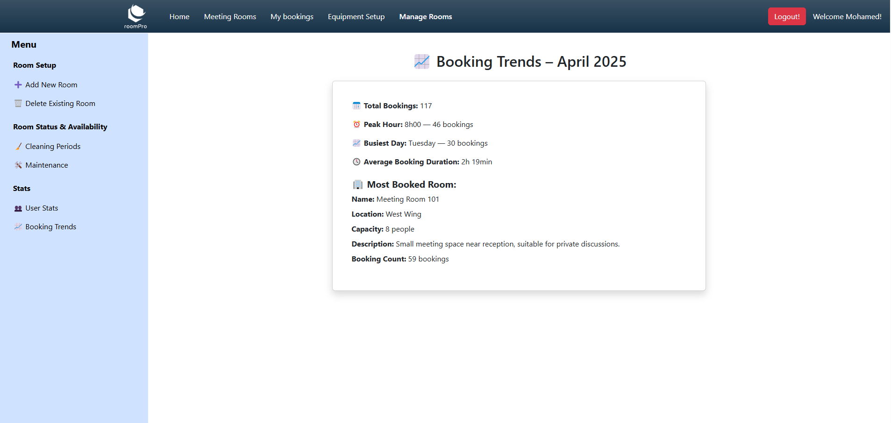
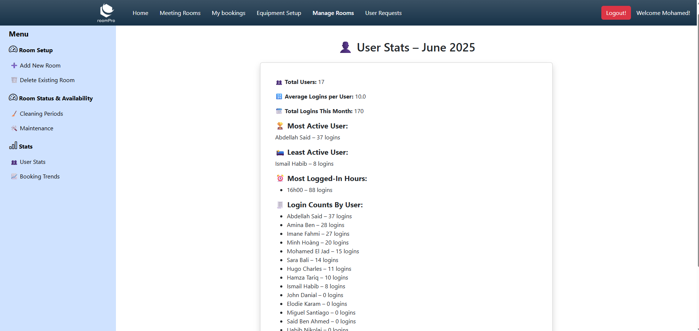

# Ongoing Web Application Project: RoomPro

## Project Overview

RoomPro is a web application that simplifies room booking and management. Built with `Spring Boot` for the backend and `Angular` for the frontend, it follows a clean architecture that separates concerns into Controllers, Services, Repositories, and Entities for scalability and maintainability. The app securely stores user and room data in a relational database.

# 🚀 Current Release: v2.6.0
## 🎉 Features up to this Release:

- `Admin pannel`: Introduced an Admin Panel :
    - `Room setup` :
        - Add new rooms via admin panel
        - Delete existing rooms

    - `Room Status & availability` :
        - Add cleaning periods
        - Add maintenance periods

    - `Booking Trends` :
        - 📊 Booking Statistics
        - ⏰ Peak Hour Tracking
        - 📈 Peak Day Insights
        - 🕓 Average Booking Duration
        - 📋 Most Booked Room

    - `Users Stats` :
        - 👥 Total Users 
        - 🔢 Logins per User
        - 🏆 Most & Least Active Users
        - 📆 Monthly Login Total
        - ⏰ Peak Login Hour
        - 📉 Login Average

- `Adding holidays`:
    - Integrated with `Nager.Date API` to automatically fetch public holidays based on the current year and country.
    - Prevents users from booking rooms on official public holidays.

- `Toast Notifications`: Real-time updates for events like successful logins and bookings.

- `Weekend Booking Restriction`: Prevents weekend bookings, allowing only future bookings during business hours.

- `Invalid Booking Restriction`: No double bookings and disallowing bookings outside of business hours (8 AM - 6 PM).

- `Calendar Integration`: FullCalendar to display room bookings with week view and dynamic reservations.

## 🏠 Pages Overview

### 1️⃣ Home Page

### 2️⃣ Rooms Page

### 3️⃣ Rooms Page / room callendat

### 4️⃣ My Bookings Page

### 5️⃣ Equipment update

### 6️⃣ Manage rooms

### 6️⃣.1️⃣ Add new rooms

### 6️⃣.2️⃣ Change cleaning type

### 6️⃣.3️⃣ Set maintenance periods

### 6️⃣.4️⃣ Booking trends

### 6️⃣.5️⃣ Users stats

## Key Features

### User Management:

 - Registration: Users can register by providing details such as first name, last name, email, password, and role (e.g., Admin, User).

 - Authentication: Secure user authentication and role-based access control.

### Room Booking:

 - Users can view and book available rooms.

 - Bookings include start and end times, ensuring no overlapping reservations.

### Admin Features:

 - 📅 Management of Rooms:

    - Add, update, and delete rooms.
    - Define room attributes (capacity, location, description) for better management.
    - Set room availability for bookings and maintenance.

 - 🧹Setting cleaning periods : there are tree types

    - Daily Cleaning: Set recurring daily cleaning times for each room.
    - Weekly Cleaning: Define cleaning schedules on specific days of the week for room rotation.
    - On-demand Cleaning: Allow users to request cleaning during their stay, with flexible timing and notifications for admins.

 - 🛠 Setting Maintenance Periods:

    - Schedule maintenance periods for each room to ensure readiness and minimize downtime.
    - Automatically block out room availability during maintenance windows.

 - 📈 Admin Views Booking Trends
    - Admins can get detailed insights into booking data, helping to optimize room usage and management:
      - Total Bookings: See the total number of bookings monthly.
      - Peak Hours: Identify the busiest hours of the day when bookings are highest.
      - Busiest Days: Visualize the days of the week that have the highest booking activity.
      - Average Booking Duration: View the average duration of bookings, which helps in planning room usage more efficiently.
      - Most Booked Room: See which room has the highest number of bookings, helping prioritize maintenance or improvements for that space.

### Database Integration:

 - Persistent storage for users, rooms, and bookings using `PostgreSQL` database.

## Project Architecture

### 1. Entities

Entities represent the core data structures of the application. These classes are annotated with JPA annotations to map them to database tables.

- `Users` : Represents users of the system, such as admin or regular users.

- `Role` :  Defines the roles available in the system, such as Admin and User. 

- `UserPrincipal` : Represents the principal (authenticated user) in the system. This entity typically holds the user details (such as username, password, roles) that are needed for authentication and authorization.

- `Booking` : Represents a booking made by a user for a specific room. 

- `Room` : Represents a room in the system. 

- `Equipment` : Represents the various equipment available for rooms. 

- `RoomEquipmentMapping` : Represents the mapping of equipment to rooms. It shows which equipment is available in which room.

- `CleaningType` : Defines various types of cleaning tasks, such as daily, weekly, and on-demand cleaning.

- `CleaningAfterUse` : Represents a specific cleaning task that occurs after a room is used, typically when the room is vacated.

- `CleaningWeekly` : Represents cleaning tasks that occur on a weekly schedule. 

- `RoomCleaningAssignment` : Represents the assignment of cleaning tasks to specific rooms. 

- `Maintenance` : Represents scheduled maintenance tasks for rooms. 

### 2. Controllers

- `UserController` : Handles user registration and login functionality.

    - `POST /register`
        - Validates required fields and email format, then registers a new user via RegistrationService.
        - Responds with a success message or error if registration fails.

    - `POST /login`
        - Validates email/password fields and format, then attempts authentication via LoginService.
        - Returns a JWT token if credentials are valid, otherwise returns an error.

- `RoomController` : Manages room-related operations including fetching, filtering, updating cleaning types, and CRUD operations.

    - `GET /meeting-rooms`
        - Returns a list of all meeting rooms.

    - `GET /meeting-rooms/cleaning`
        - Returns all rooms along with their assigned cleaning type.

    - `GET /meeting-rooms/cleaning/update`
        - Updates a room's cleaning type by providing room ID, new cleaning type ID, and previous cleaning ID.

    - `GET /meeting-rooms/filter`
        - Filters rooms based on optional parameters: capacity, location, and equipmentNames.

    - `POST /add-meeting-rooms`
        - Adds a new meeting room after validating required fields like name, capacity, description, and location.

    - `DELETE /meeting-rooms/delete/{room_id}`
        - Deletes a room by its ID, returns a message or error if the operation fails.

- `BookingController` : Handles booking-related functionalities for users and admins, including creating, viewing, canceling bookings, and analyzing trends.

   - `POST /booking` : 
     - Creates a new booking. Requires startTime and bookingHours. Returns success message or validation error.

   - `GET /my-bookings` :  
     - Returns the list of bookings made by the currently authenticated user.

   - `GET /booking/room/{room_id}`:  
     - Retrieves all bookings associated with a specific room.

   - `DELETE /my-bookings/cancel/{booking_id}`:  
     - Cancels a user’s booking by ID. Returns a confirmation or error message.

   - `GET /booking/trends/{year}/{month}` :  
     - Returns monthly booking trends including total bookings, peak hour/day, average duration, and most booked room.

- `EquipmentController` : Manages the room-equipment relationships and equipment data.

   - `GET /equipments?roomId=`
     - Fetches all available equipment, optionally filtered by a specific room ID.

   - `POST /equipments-update`
     - Updates room-equipment associations. Accepts a list of add/remove actions and applies the mapping accordingly.

- `MaintenanceController` : Handles the scheduling and management of room maintenance periods.

   - `GET /maintenance/get-slots?roomId=`
     - Retrieves all maintenance slots for a specific room.

   - `GET /maintenance/get-slots/all`
     - Fetches all maintenance periods across all rooms.

   - `DELETE /maintenance/delete/{maintenance_id}`
     - Deletes a maintenance entry by ID.

   - `POST /maintenance/add`
     - Adds a new maintenance slot. Requires room ID, start date, and end date.

- `CleaningController` : Handles room cleaning schedules based on two types: after-use and weekly.

   - `GET /cleaning/after-use?roomId=`
     - Retrieves a list of after-use cleaning time slots for a given room.

   - `GET /cleaning/weekly?roomId=`
     - Returns the weekly cleaning schedule for a specific room (only the most recent set).
